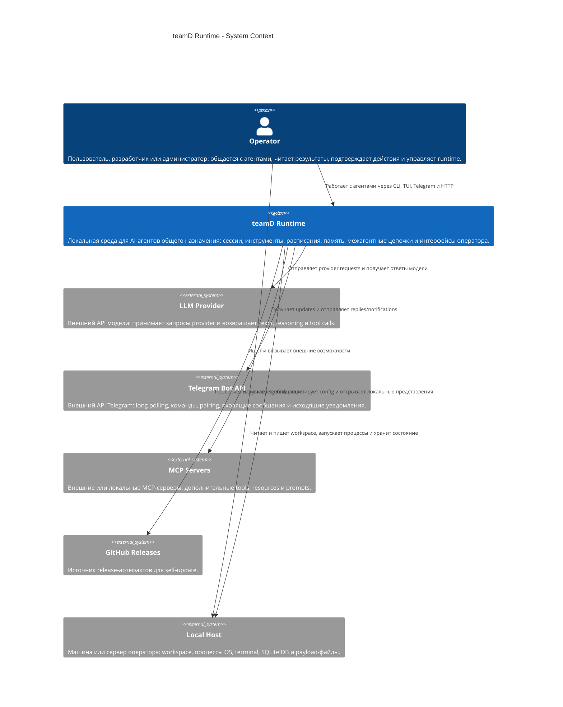

# C4 Level 1: System Context

Источник модели: [`workspace.dsl`](workspace.dsl), представление `SystemContext`.

Эта страница дублирует System Context из Structurizr DSL в Mermaid C4, потому что GitHub рендерит Mermaid прямо в Markdown без локальных рендереров.

## Граница системы

`teamD Runtime` — локальная среда для AI-агентов общего назначения. На этом уровне она считается одной системой: внутренние части (`agentd`, daemon, TUI backend, Telegram worker, persistence, provider loop) будут раскрыты на диаграммах C4 Container и C4 Component.

## Люди и внешние системы

| C4-элемент | Название | Роль |
| --- | --- | --- |
| Person | `Operator` | Пользователь, разработчик или администратор: общается с агентами, читает результаты, подтверждает действия, управляет runtime. |
| Software System | `LLM Provider` | Внешний API модели: принимает запросы provider и возвращает текст, reasoning, tool calls. |
| Software System | `Telegram Bot API` | Внешний API Telegram: long polling, команды, pairing, входящие и исходящие сообщения. |
| Software System | `MCP Servers` | Внешние или локальные MCP-серверы: дополнительные tools, resources, prompts. |
| Software System | `GitHub Releases` | Источник release-артефактов для self-update. |
| Software System | `Local Host` | Машина или сервер оператора: workspace, процессы OS, terminal, SQLite DB, payload-файлы. |

## Основные связи

| Откуда | Куда | Смысл |
| --- | --- | --- |
| `Operator` | `teamD Runtime` | Работает с агентами через CLI, TUI, Telegram и HTTP. |
| `Operator` | `Local Host` | Запускает `agentd`, редактирует конфиг, открывает локальные представления. |
| `teamD Runtime` | `LLM Provider` | Отправляет provider requests и получает ответы модели и tool calls. |
| `teamD Runtime` | `Telegram Bot API` | Получает updates и отправляет replies/notifications. |
| `teamD Runtime` | `MCP Servers` | Ищет и вызывает внешние возможности. |
| `teamD Runtime` | `GitHub Releases` | Проверяет и скачивает обновления. |
| `teamD Runtime` | `Local Host` | Читает и пишет workspace, запускает процессы, хранит состояние. |

## Что не показано на этом уровне

- Внутренние контейнеры `teamD Runtime`.
- Модель данных runtime: `Session`, `Run`, `Job`, `Tool`, `Artifact`.
- Конкретные HTTP endpoints и экраны TUI.
- Детальный поток `chat turn`.

Следующий уровень: C4 Container diagram для `teamD Runtime`.
