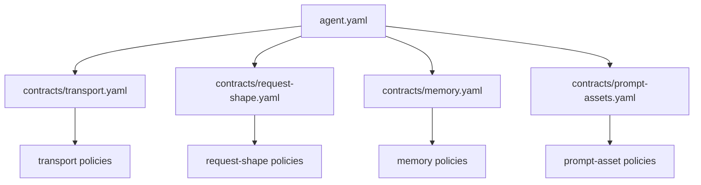
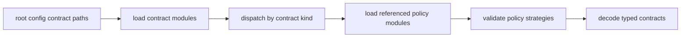
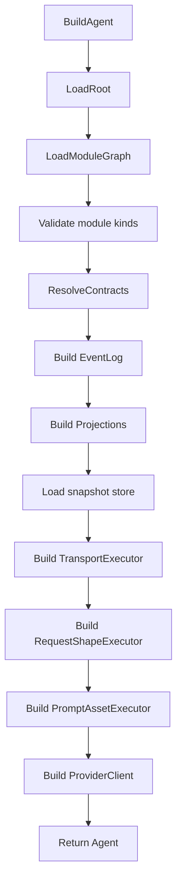
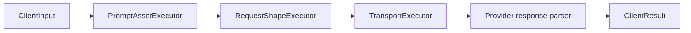
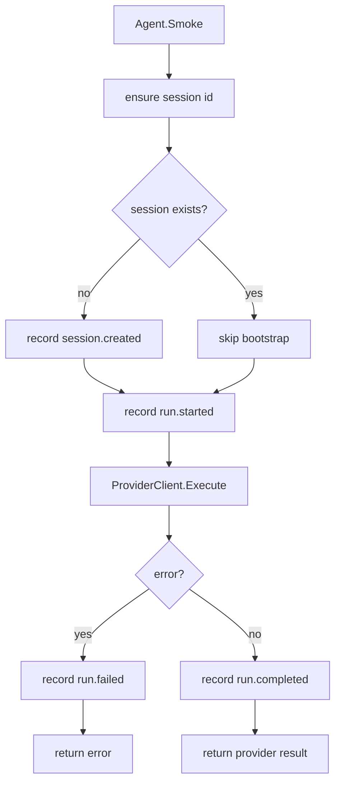
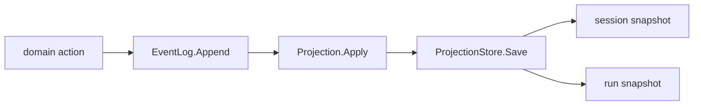
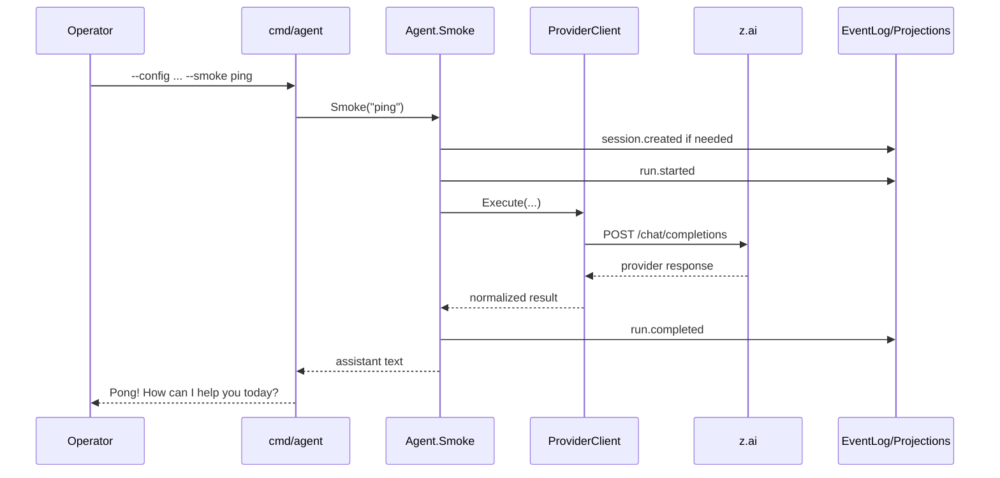

# Clean-Room Agent: Current Detailed System Description

This document is the single detailed description of how the clean-room agent works today in `rewrite/clean-room-root`.

It is intentionally descriptive, not aspirational.
It explains the system as it exists now in code.

## 1. What This Branch Is

This branch is a clean-room rewrite of the agent runtime.

Its current implementation principles are:

- one binary
- one root config per agent instance
- explicit modular config graph
- event log as the runtime history
- projections as the current read models
- behavior expressed through resolved contracts and executors
- no legacy runtime imports in the new core

The branch currently provides:

- a buildable clean-room agent binary
- a modular `z.ai` smoke config
- a working smoke path from CLI to provider response
- persistent event log and projection snapshots
- GitHub Actions artifacts for Linux and Windows binaries

## 2. Top-Level Runtime Shape

At the highest level, the system currently works like this:

```text
cmd/agent
  -> autoload .env
  -> parse CLI flags
  -> BuildAgent(config)
     -> load root config
     -> load module graph
     -> validate module kinds
     -> resolve contracts
     -> build runtime components
  -> optionally run smoke request
     -> record events
     -> call provider pipeline
     -> update projections
     -> persist snapshots
```

```mermaid
flowchart TD
    A[cmd/agent] --> B[autoload .env]
    B --> C[parse CLI flags]
    C --> D[BuildAgent(config)]
    D --> E[load root config]
    E --> F[load module graph]
    F --> G[validate module kinds]
    G --> H[resolve contracts]
    H --> I[build runtime components]
    I --> J{--smoke?}
    J -- no --> K[exit]
    J -- yes --> L[Agent.Smoke]
    L --> M[record events]
    L --> N[provider pipeline]
    L --> O[update projections]
    L --> P[persist snapshots]
    L --> Q[print assistant text]
```

The important thing is that `main` does not assemble runtime pieces itself.
It delegates assembly to `runtime.BuildAgent`.

## 3. Entry Point

Current entry file:

- [main.go](/home/admin/AI-AGENT/data/projects/teamD/.worktrees/rewrite-clean-room-root/cmd/agent/main.go)

What it currently does:

1. reads CLI flags
2. autoloads `./.env` if present
3. builds the runtime agent from `--config`
4. if `--smoke` is given, sends one smoke request
5. prints the assistant message to stdout

Current CLI surface:

- `--config <path>` is required
- `--smoke "<text>"` is optional

If `--smoke` is omitted:

- the binary only validates that the config can be loaded and the runtime can be built
- then it exits without output

That is why running only:

```bash
./agent --config ./config/zai-smoke/agent.yaml
```

looks like “nothing happened”.

That is current behavior by design.

## 4. Environment Loading

The agent now autoloads `./.env` before it builds the runtime.

Current rules:

- if `.env` does not exist, nothing happens
- if a variable already exists in the process environment, `.env` does not override it
- `.env` is only a convenience loader for local operator workflow

This means the precedence is:

```text
already-set process env
  > .env file
```

Current example environment file:

- [.env.example](/home/admin/AI-AGENT/data/projects/teamD/.worktrees/rewrite-clean-room-root/.env.example)

Current important variable for `z.ai` smoke:

- `TEAMD_ZAI_API_KEY`

## 5. Root Config Model

Current root config type:

- [types.go](/home/admin/AI-AGENT/data/projects/teamD/.worktrees/rewrite-clean-room-root/internal/config/types.go)

Current structure:

```yaml
kind: AgentConfig
version: v1
id: <agent-id>
spec:
  runtime:
    event_log: ...
    event_log_path: ...
    projection_store_path: ...
    prompt_asset_executor: ...
    transport_executor: ...
    request_shape_executor: ...
    provider_client: ...
    projections: [...]
  contracts:
    transport: ...
    request_shape: ...
    memory: ...
    prompt_assets: ...
```

Current meaning:

- `spec.runtime` chooses runtime components by id
- `spec.contracts` points to contract modules on disk

Important constraint:

- the system is explicit
- there is no inheritance
- there are no hidden imports
- all contract module paths are resolved relative to the root config file

## 6. Config Graph Loading

Current files:

- [loader.go](/home/admin/AI-AGENT/data/projects/teamD/.worktrees/rewrite-clean-room-root/internal/config/loader.go)
- [registry.go](/home/admin/AI-AGENT/data/projects/teamD/.worktrees/rewrite-clean-room-root/internal/config/registry.go)

What happens:

1. `LoadRoot(path)` reads the root YAML
2. all contract paths are resolved relative to the root config directory
3. runtime persistence paths are resolved relative to the root config directory
4. `LoadModuleGraph(...)` walks the module graph

The graph walk is registry-driven:

- the loader asks the module registry what a module kind is
- the registry says whether it is a `contract` or `policy`
- the registry also says which fields in `spec` are references to other modules

That means the graph walker does not hardcode:

- “transport has these exact child fields”
- “memory has those exact child fields”

Instead, it follows whatever `RefFields` are defined for the module kind.

Current limitation:

- the loader builds a graph of headers and references
- it does not itself decode full typed contract bodies
- typed decoding happens later in the contract resolver



## 7. Contract Resolution

Current files:

- [contract_resolver.go](/home/admin/AI-AGENT/data/projects/teamD/.worktrees/rewrite-clean-room-root/internal/runtime/contract_resolver.go)
- [contracts.go](/home/admin/AI-AGENT/data/projects/teamD/.worktrees/rewrite-clean-room-root/internal/contracts/contracts.go)
- [registry.go](/home/admin/AI-AGENT/data/projects/teamD/.worktrees/rewrite-clean-room-root/internal/policies/registry.go)

Current flow:

```text
root config
  -> contract path
    -> contract module kind
      -> kind-specific resolver
        -> referenced policy modules
          -> strategy validation
            -> typed resolved contracts
```



Important current design point:

- root config map keys are not the source of truth for decoding
- loaded module `kind` is the source of truth

So the resolver currently dispatches by contract `kind`, not by the name of the map entry in `spec.contracts`.

Current resolved contract families:

- `TransportContract`
- `RequestShapeContract`
- `MemoryContract`
- `PromptAssetsContract`

Current policy validation:

- each loaded policy module has a `kind`
- each policy kind has allowed strategy names
- invalid strategy names fail resolution before runtime execution begins

## 8. Runtime Builder

Current files:

- [agent_builder.go](/home/admin/AI-AGENT/data/projects/teamD/.worktrees/rewrite-clean-room-root/internal/runtime/agent_builder.go)
- [component_registry.go](/home/admin/AI-AGENT/data/projects/teamD/.worktrees/rewrite-clean-room-root/internal/runtime/component_registry.go)

Current `BuildAgent(configPath)` flow:

```text
LoadRoot
  -> LoadModuleGraph
  -> validate module kinds
  -> ResolveContracts
  -> build event log
  -> build projections
  -> optionally load projection snapshots
  -> build transport executor
  -> build request-shape executor
  -> build prompt-asset executor
  -> build provider client
  -> return Agent
```



Current runtime `Agent` contains:

- `Config`
- `Contracts`
- `PromptAssets`
- `Transport`
- `RequestShape`
- `ProviderClient`
- `EventLog`
- `Projections`
- `ProjectionStore`
- `Now`
- `NewID`

`Now` and `NewID` exist mainly to make runtime behavior deterministic and testable.

## 9. Current Runtime Components

The component registry currently knows how to build:

- event logs:
  - `in_memory`
  - `file_jsonl`
- prompt-asset executor:
  - `prompt_asset_default`
- transport executor:
  - `transport_default`
- request-shape executor:
  - `request_shape_default`
- provider client:
  - `provider_client_default`
- projections:
  - `session`
  - `run`

Current limitation:

- this is still a built-in registry
- components are selected by config id
- but the set of available implementations is still compiled into the binary

## 10. Provider Pipeline

This is the most important operational path in the current clean-room runtime.

Current files:

- [prompt_asset_executor.go](/home/admin/AI-AGENT/data/projects/teamD/.worktrees/rewrite-clean-room-root/internal/provider/prompt_asset_executor.go)
- [request_shape_executor.go](/home/admin/AI-AGENT/data/projects/teamD/.worktrees/rewrite-clean-room-root/internal/provider/request_shape_executor.go)
- [transport_executor.go](/home/admin/AI-AGENT/data/projects/teamD/.worktrees/rewrite-clean-room-root/internal/provider/transport_executor.go)
- [client.go](/home/admin/AI-AGENT/data/projects/teamD/.worktrees/rewrite-clean-room-root/internal/provider/client.go)

Current execution chain:

```text
ClientInput
  -> PromptAssetExecutor.Build(...)
  -> RequestShapeExecutor.Build(...)
  -> TransportExecutor.Execute(...)
  -> parseProviderResponse(...)
  -> ClientResult
```



### 10.1 Prompt Asset Executor

Input:

- resolved `PromptAssetsContract`
- selected prompt asset ids

Output:

- `prepend` messages
- `append` messages

Current behavior:

- only `inline_assets` is implemented
- if asset ids are selected, only those assets are applied
- placements:
  - `prepend`
  - `append`
- unknown selected ids are errors

### 10.2 Request Shape Executor

Input:

- resolved `RequestShapeContract`
- prepend prompt assets
- append prompt assets
- raw user/assistant messages
- tools

Output:

- exact JSON request body bytes

Current supported payload fields:

- `model`
- `messages`
- `tools`
- `response_format`
- `stream`
- `temperature`
- `top_p`
- `max_output_tokens`

Current message assembly:

```text
prepend prompt assets
  + raw messages
  + append prompt assets
```

### 10.3 Transport Executor

Input:

- resolved `TransportContract`
- raw body bytes
- content type

Output:

- `Response`
  - status code
  - headers
  - body

Current supported transport behavior:

- endpoint strategy:
  - `static`
- auth strategies:
  - `none`
  - `bearer_token`
- retry strategies:
  - `none`
  - `fixed`
  - `exponential`
  - `exponential_jitter`
- timeout strategy:
  - `per_request`

Current unsupported transport areas:

- TLS policy execution
- rate-limit policy execution

### 10.4 Provider Client

Input:

- resolved contracts
- messages
- selected prompt assets
- tools

Output:

- request body bytes
- raw transport response
- normalized provider response

Current normalized provider response contains:

- `id`
- `model`
- first assistant message
- `finish_reason`
- usage:
  - `input_tokens`
  - `output_tokens`
  - `total_tokens`

Current limitation:

- parsing assumes an OpenAI-compatible response shape
- richer provider semantics are still tracked as follow-up work

## 11. Smoke Runtime Path

Current file:

- [smoke.go](/home/admin/AI-AGENT/data/projects/teamD/.worktrees/rewrite-clean-room-root/internal/runtime/smoke.go)

This file is the runtime seam that turns the provider pipeline into an actual executable agent action.

Current smoke flow:

```text
Agent.Smoke(prompt)
  -> ensure session id
  -> create session if projection does not already show one
  -> record session.created
  -> record run.started
  -> ProviderClient.Execute(...)
  -> if error:
       record run.failed
       return error
     else:
     record run.completed
     return provider result
```



Important current behavior:

- smoke creates a synthetic session id if one is not provided
- default session id:
  - `smoke:<agent-id>`
- run ids are generated through `NewID`

Current smoke CLI path:

```text
cmd/agent --config ... --smoke "ping"
  -> BuildAgent(...)
  -> Agent.Smoke(...)
  -> print provider message content
```

## 12. Event Model

Current file:

- [events.go](/home/admin/AI-AGENT/data/projects/teamD/.worktrees/rewrite-clean-room-root/internal/runtime/eventing/events.go)

Current aggregate types:

- `session`
- `run`

Current event kinds:

- `session.created`
- `run.started`
- `run.completed`
- `run.failed`

Current event envelope fields:

- `Sequence`
- `ID`
- `Kind`
- `OccurredAt`
- `AggregateID`
- `AggregateType`
- `AggregateVersion`
- `CorrelationID`
- `CausationID`
- `Source`
- `ActorID`
- `ActorType`
- `TraceSummary`
- `TraceRefs`
- `ArtifactRefs`
- `Payload`

This is the current event-sourced backbone of the runtime.

## 13. Event Log Implementations

Current file:

- [event_log.go](/home/admin/AI-AGENT/data/projects/teamD/.worktrees/rewrite-clean-room-root/internal/runtime/event_log.go)

Current implementations:

### `InMemoryEventLog`

Used for:

- tests
- temporary runtime cases

Behavior:

- stores events in memory
- assigns `Sequence` if missing
- lists by aggregate

### `FileEventLog`

Used for:

- persistent local runtime history

Behavior:

- appends JSON-encoded events to a local JSONL file
- restores last known `Sequence` on reopen
- can list by aggregate by scanning the file

Current limitation:

- it is local append-only storage
- there is no compaction or richer indexing yet

## 14. Projections

Current projection interface:

- [projection.go](/home/admin/AI-AGENT/data/projects/teamD/.worktrees/rewrite-clean-room-root/internal/runtime/projections/projection.go)

Current built-in projections:

- [session.go](/home/admin/AI-AGENT/data/projects/teamD/.worktrees/rewrite-clean-room-root/internal/runtime/projections/session.go)
- [run.go](/home/admin/AI-AGENT/data/projects/teamD/.worktrees/rewrite-clean-room-root/internal/runtime/projections/run.go)

### 14.1 Session Projection

Current role:

- project `session.created` into:
  - `SessionID`
  - `CreatedAt`

### 14.2 Run Projection

Current role:

- project:
  - `run.started`
  - `run.completed`
  - `run.failed`

Current run snapshot fields:

- `RunID`
- `SessionID`
- `Status`

Current statuses:

- `running`
- `completed`
- `failed`

### 14.3 Snapshot Store

Current file:

- [store.go](/home/admin/AI-AGENT/data/projects/teamD/.worktrees/rewrite-clean-room-root/internal/runtime/projections/store.go)

Current behavior:

- serialize current projection snapshots to JSON
- restore them on startup

Current runtime path:

```text
RecordEvent(...)
  -> append to EventLog
  -> apply to every Projection
  -> if ProjectionStore exists:
       save all snapshots
```



So projections are currently:

- event-driven
- persisted after each recorded event

## 15. The Real z.ai Config Graph

Current real smoke config:

- [agent.yaml](/home/admin/AI-AGENT/data/projects/teamD/.worktrees/rewrite-clean-room-root/config/zai-smoke/agent.yaml)

Current graph layout:

```text
config/zai-smoke/
  agent.yaml
  contracts/
    transport.yaml
    request-shape.yaml
    memory.yaml
    prompt-assets.yaml
  policies/
    transport/
      endpoint.yaml
      auth.yaml
      retry.yaml
      timeout.yaml
    request-shape/
      model.yaml
      messages.yaml
      tools.yaml
      response-format.yaml
      streaming.yaml
      sampling.yaml
    memory/
      offload.yaml
    prompt-assets/
      assets.yaml
```

Current important `z.ai` values:

- base URL:
  - `https://api.z.ai/api/coding/paas/v4`
- path:
  - `/chat/completions`
- auth env var:
  - `TEAMD_ZAI_API_KEY`
- model:
  - `glm-5-turbo`

Current persistence targets:

- event log:
  - `var/zai-smoke/events.jsonl`
- projection snapshots:
  - `var/zai-smoke/projections.json`

## 16. What Happens During a Real Live Smoke Request

This is the current real operator path that was verified live.

```text
operator runs:
  ./agent --config ./config/zai-smoke/agent.yaml --smoke ping

cmd/agent:
  loads .env if present
  builds runtime agent

runtime:
  checks if smoke session exists
  records session.created if needed
  records run.started

provider client:
  resolves prompt assets
  builds request JSON
  executes HTTP request
  parses provider response

runtime:
  records run.completed
  updates run/session projections
  persists event log and projection snapshots

CLI:
  prints assistant message to stdout
```

Current verified live response was:

```text
Pong! How can I help you today?
```



Current verified artifacts were:

- `var/zai-smoke/events.jsonl`
- `var/zai-smoke/projections.json`

## 17. Binary and CI Artifact Path

Current workflow:

- [.github/workflows/build-agent-artifact.yml](/home/admin/AI-AGENT/data/projects/teamD/.worktrees/rewrite-clean-room-root/.github/workflows/build-agent-artifact.yml)

Current GitHub Actions behavior:

- runs on push to:
  - `master`
  - `rewrite/clean-room-root`
- can also run manually
- runs tests
- builds:
  - Linux amd64 binary
  - Windows amd64 binary
- uploads both as GitHub workflow artifacts

Current artifact names:

- `teamd-agent-linux-amd64`
- `teamd-agent-windows-amd64`

## 18. Current Known Limits

This is the honest current boundary of the system.

It already works, but it is not the final architecture.

Current known limits:

1. config graph loading still stops at headers and references, not full semantic decode
2. builder still uses only the built-in component registry
3. provider response parsing still assumes OpenAI-compatible body shape
4. richer provider semantics like reasoning/tool calls are not implemented yet
5. TLS and rate-limit transport policy execution are not implemented yet
6. prompt asset execution currently supports only inline assets
7. policy merge layers like `global < session < run` are not implemented yet

## 19. The Most Important Files To Read

If you want to understand the current system quickly, read in this order:

1. [main.go](/home/admin/AI-AGENT/data/projects/teamD/.worktrees/rewrite-clean-room-root/cmd/agent/main.go)
2. [agent_builder.go](/home/admin/AI-AGENT/data/projects/teamD/.worktrees/rewrite-clean-room-root/internal/runtime/agent_builder.go)
3. [smoke.go](/home/admin/AI-AGENT/data/projects/teamD/.worktrees/rewrite-clean-room-root/internal/runtime/smoke.go)
4. [client.go](/home/admin/AI-AGENT/data/projects/teamD/.worktrees/rewrite-clean-room-root/internal/provider/client.go)
5. [request_shape_executor.go](/home/admin/AI-AGENT/data/projects/teamD/.worktrees/rewrite-clean-room-root/internal/provider/request_shape_executor.go)
6. [transport_executor.go](/home/admin/AI-AGENT/data/projects/teamD/.worktrees/rewrite-clean-room-root/internal/provider/transport_executor.go)
7. [contract_resolver.go](/home/admin/AI-AGENT/data/projects/teamD/.worktrees/rewrite-clean-room-root/internal/runtime/contract_resolver.go)
8. [event_log.go](/home/admin/AI-AGENT/data/projects/teamD/.worktrees/rewrite-clean-room-root/internal/runtime/event_log.go)
9. [run.go](/home/admin/AI-AGENT/data/projects/teamD/.worktrees/rewrite-clean-room-root/internal/runtime/projections/run.go)
10. [agent.yaml](/home/admin/AI-AGENT/data/projects/teamD/.worktrees/rewrite-clean-room-root/config/zai-smoke/agent.yaml)

## 20. One-Screen Summary

If compressed to one screen, the system today is:

```text
CLI
  -> .env autoload
  -> root config
  -> module graph
  -> contract resolution
  -> runtime builder
  -> smoke runtime seam
  -> provider client
     -> prompt assets
     -> request shape
     -> transport
     -> provider parsing
  -> event log append
  -> projections update
  -> snapshot persistence
  -> stdout response
```

That is the current clean-room agent as it exists now.
