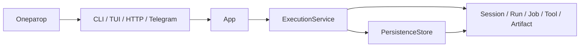
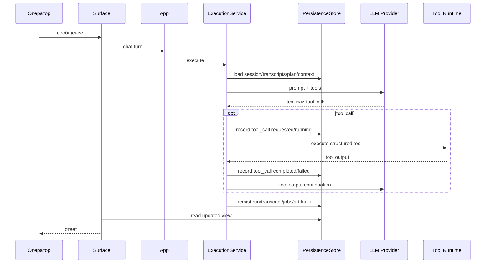

# Обзор системы

## Что делает `teamD`

`teamD` — это локальная среда для AI-агентов общего назначения. Система хранит сессии, историю общения, планы, фоновые задачи, межагентные цепочки, артефакты и результаты работы инструментов. Оператор может работать с этим через CLI, HTTP API, полноэкранный TUI или Telegram, но все интерфейсы должны вести в один и тот же runtime.

Проще говоря:

- оператор открывает сессию;
- пишет сообщение агенту;
- система собирает prompt из системных блоков и истории;
- вызывает provider;
- provider может попросить инструменты;
- runtime исполняет инструменты, approval’ы и фоновые jobs;
- результаты сохраняются в SQLite и связанных payload-файлах: sessions, runs, jobs, approvals, tool-call ledger, indexes, transcripts, artifacts, context summaries, schedules, Telegram bindings и diagnostic events;
- CLI/TUI/HTTP просто показывают одно и то же состояние разными способами.

## System Context

C4 System Context хранится в [docs/architecture/01-system-context.md](../architecture/01-system-context.md). GitHub рендерит диаграмму прямо в Markdown.

Диаграмма намеренно показывает только границу системы. Внутренние контейнеры (`agentd`, daemon, TUI backend, persistence, provider loop) раскрываются на следующих C4-уровнях.

## Главные сущности

В документации ниже разделяются два уровня терминов:

- **Предметные сущности** — то, чем оперирует пользователь: `Session`, `Agent profile`, `Run`, `Job`, `Tool`, `Artifact`.
- **Программные сущности** — Rust-типы и сервисные объекты, через которые это реализовано: `App`, `ExecutionService`, `PersistenceStore`, HTTP/TUI/Telegram handlers.

Связь простая: поверхности взаимодействия вызывают методы `App`, `App` создаёт `ExecutionService`, `ExecutionService` меняет предметные сущности и сохраняет их через `PersistenceStore`.

### App

[`App`](../../cmd/agentd/src/bootstrap.rs) — корневой объект процесса. Он знает:

- какой конфиг загружен;
- где лежат persistent stores;
- какой workspace/scaffold передан процессу;
- как собран runtime scaffold;
- как ходить к release updater, processes registry и MCP registry.

Практически всё операторское API начинается с `bootstrap::build()`, которое создаёт `App`, а потом `App::run()` передаёт управление CLI/daemon/TUI.

### Session

`Session` — один диалог/контекст агента. Это предметная сущность, которую оператор видит как “чат”. У неё есть:

- `id`
- `title`
- `agent_profile_id`
- `settings`
- timestamps
- optional parent/delegation metadata

Сессия — это контейнер для transcript, runs, jobs, планов, approvals, memory и inter-agent chain state.

### Run

`Run` — конкретное выполнение модели внутри session. Обычно это:

- обычный chat turn;
- background chat turn;
- approval continuation;
- wakeup turn.

У run есть `status`, `recent_steps`, provider usage, pending approvals, loop state и итоговый текст/ошибка.

### Job

`Job` — рабочая единица вокруг run. Нужна, потому что не всё исполняется синхронно в том же потоке, где был создан пользовательский запрос.

Примеры job kinds:

- `ChatTurn`
- `ScheduledChatTurn`
- `MissionTurn`
- `InterAgentMessage`
- `ApprovalContinuation`
- `Delegate`

Фоновые worker’ы гоняют именно jobs, а не “сырые” transcript-записи.

### Tool

`Tool` — структурированный вызов capability, который модель делает через канонический tool surface. Определения живут в [`crates/agent-runtime/src/tool.rs`](../../crates/agent-runtime/src/tool.rs).

Главная идея: модель не должна изобретать shell snippets. Она вызывает named tool с typed input, а runtime сам решает, как это выполнить и как отдать результат обратно.

Runtime отдельно пишет ledger вызовов tools в таблицу `tool_calls`: tool name, arguments JSON, status, error, timestamps и bounded preview результата. Это audit trail “что модель просила сделать” и “что runtime вернул”. Полный крупный output не раздувает SQLite: он сохраняется в `artifacts` как `tool_output`, а `tool_calls.result_artifact_id` указывает на payload.

### Artifact

Большие tool outputs не пихаются целиком в prompt. Они уходят в artifact/offload storage, а модель получает bounded summary и ссылку на артефакт.

### Agent profile

`Agent profile` — это персонализация агента:

- имя;
- шаблон (`default`, `judge`);
- `SYSTEM.md` и `AGENTS.md` в `agent_home`;
- allowlist capabilities;
- operator-visible metadata.

Текущий `agent_home` живёт в `data_dir/agents/<agent_id>/` и содержит `SYSTEM.md`, `AGENTS.md` и `skills/`. Это похоже на editable profile home, а не на полноценный project workspace. План разделения `agent templates`, `agent profiles` и рабочих директорий описан в [11-workspace-modernization-plan.md](11-workspace-modernization-plan.md).

## Как один запрос проходит через систему

Упрощённая цепочка:

1. Оператор пишет сообщение в CLI/TUI или вызывает HTTP endpoint.
2. Поверхность обращается к `App`.
3. `App` создаёт `ExecutionService`.
4. `ExecutionService` загружает session, transcripts, runs, plan, context summary, skills.
5. `prompting.rs` собирает `SessionHead`.
6. `PromptAssembly` строит messages в каноническом порядке.
7. Provider получает request и может вернуть текст, reasoning и/или tool calls.
8. `provider_loop.rs` выполняет tool round’ы, approvals и continuation logic.
9. Все изменения пишутся в `PersistenceStore`.
10. CLI/TUI/HTTP читают обновлённое состояние из store.

## Почему daemon-centered

В проекте специально избегают отдельного “TUI-runtime” или “CLI-runtime”. Идея такая:

- execution semantics должны быть одинаковыми;
- баги и recovery должны чиниться один раз, а не по слоям;
- transcript, approvals, jobs и inter-agent state должны быть общими;
- тесты должны проверять один execution path.

Это видно по тому, что:

- CLI умеет работать напрямую или через daemon;
- TUI использует daemon-backed backend;
- HTTP endpoints и TUI backend вызывают те же операции `App` и `ExecutionService`.

## Куда идти дальше

- Общая архитектура: [01-architecture.md](01-architecture.md)
- Prompt и chat turn: [02-prompt-and-turn-flow.md](02-prompt-and-turn-flow.md)
- Детальный prompt contract: [12-prompt-contract-decision.md](12-prompt-contract-decision.md)
- Интерфейсы CLI/HTTP/TUI: [03-surfaces.md](03-surfaces.md)
- Хранилище и recovery: [06-storage-recovery-and-diagnostics.md](06-storage-recovery-and-diagnostics.md)
