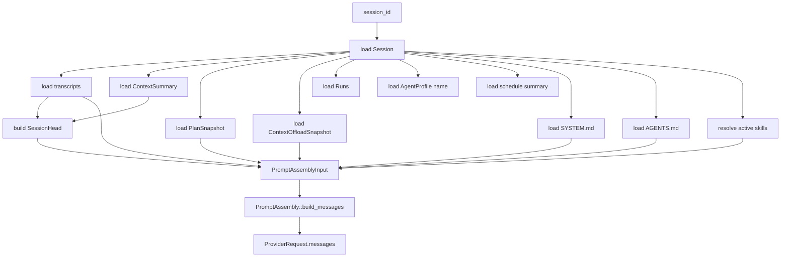
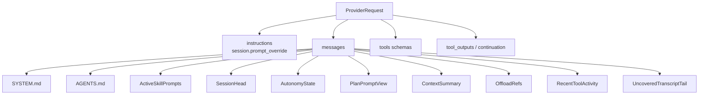
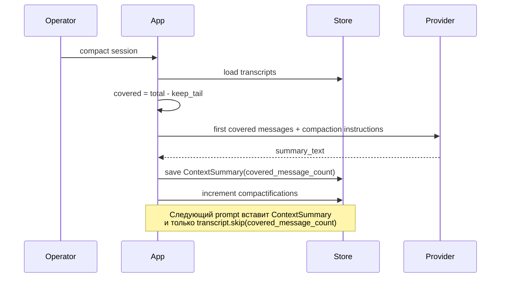

# Prompt contract: подробный черновик решения

Этот документ фиксирует, как `teamD` сейчас собирает prompt, какие части спорные и какие решения нужно принять перед рефакторингом. Документ намеренно подробный: его задача не “продать” один вариант, а дать оператору и разработчику общий язык для обсуждения.

Статус: decision draft.

Дата фиксации: 2026-04-24.

Основной код:

- [`cmd/agentd/src/execution/provider_loop.rs`](../../cmd/agentd/src/execution/provider_loop.rs) — загрузка состояния и сборка `ProviderRequest`.
- [`cmd/agentd/src/prompting.rs`](../../cmd/agentd/src/prompting.rs) — загрузка prompt-файлов и построение `SessionHead`.
- [`crates/agent-runtime/src/prompt.rs`](../../crates/agent-runtime/src/prompt.rs) — `PromptAssembly::build_messages`.
- [`crates/agent-runtime/src/context.rs`](../../crates/agent-runtime/src/context.rs) — `ContextSummary`, `ContextOffloadSnapshot`, `CompactionPolicy`.
- [`crates/agent-runtime/src/plan.rs`](../../crates/agent-runtime/src/plan.rs) — rendering текущего `PlanSnapshot`.
- [`cmd/agentd/src/agents.rs`](../../cmd/agentd/src/agents.rs) — built-in agent templates и fallback prompt texts.

## Цель prompt contract

Prompt contract отвечает на вопросы:

- что именно модель получает на вход;
- в каком порядке это вставляется;
- какие данные обязательны;
- какие данные должны быть bounded;
- какие данные должны читаться через tools/artifacts, а не вставляться в prompt;
- какие части являются runtime state, а какие являются пользовательской перепиской;
- как оператор может проверить, что реально ушло в provider.

Без явного contract система быстро деградирует:

- CLI, TUI, Telegram и HTTP начинают вести себя по-разному;
- agent profiles начинают неявно менять runtime semantics;
- prompt раздувается диагностикой;
- tools начинают использоваться хуже, потому что инструкция размазана по разным слоям;
- long sessions становятся непредсказуемыми из-за summary/offload/tail.

## Термины

### ProviderRequest

`ProviderRequest` — полный запрос в LLM provider. Это больше, чем prompt messages.

В него входят:

- `model`;
- `instructions`;
- `messages`;
- `think_level`;
- `previous_response_id`;
- `continuation_messages`;
- `tools`;
- `tool_outputs`;
- `max_output_tokens`;
- `stream`.

Важно: когда мы говорим “prompt assembly”, обычно речь идёт только о `messages`. Но provider реально видит ещё `instructions`, tool schemas, tool outputs и continuation state.

### ProviderMessage

`ProviderMessage` — одно сообщение с ролью:

- `system`;
- `user`;
- `assistant`;
- `tool`.

`PromptAssembly::build_messages` строит базовый список `ProviderMessage`. Потом `ProviderLoopCursor` может добавить continuation messages и tool outputs.

### instructions

`instructions` сейчас берётся из `session.prompt_override` и передаётся как отдельное поле `ProviderRequest.instructions`.

Это не обычный transcript message и не часть `PromptAssembly::build_messages`.

Практический вывод: если оператор хочет понять “всё, что повлияло на модель”, нужно смотреть не только `[Assembled Prompt Messages]`, но и `instructions`.

### Transcript

`Transcript` — persisted история сессии: сообщения пользователя, ассистента и runtime/system events.

Обычный transcript — это не tool-call ledger. Вызовы tools и их результаты хранятся отдельно в `tool_calls` и `artifacts`.

### covered transcript

`covered transcript` — старая часть transcript, которую уже покрывает `ContextSummary`.

Если `ContextSummary.covered_message_count = 10`, то первые 10 transcript entries не вставляются в prompt напрямую. Вместо них вставляется summary.

### uncovered transcript tail

`uncovered transcript tail` — часть transcript после `covered_message_count`.

Это не только “переписка пользователя и агента”. В нормальном случае там чаще всего есть `user` и `assistant`, но также могут быть `system` entries: wakeup, schedule delivery, inter-agent metadata, служебные события runtime. Тип `tool` тоже поддерживается моделью данных, но обычные результаты tools не должны превращаться в большой transcript tail.

### ContextSummary

`ContextSummary` — сжатое summary старой части transcript.

Поля:

- `session_id`;
- `summary_text`;
- `covered_message_count`;
- `summary_token_estimate`;
- `updated_at`.

### ContextOffloadRef

`ContextOffloadRef` — короткая ссылка на большой payload, который нельзя держать в prompt.

Поля:

- `id`;
- `label`;
- `summary`;
- `artifact_id`;
- `token_estimate`;
- `message_count`;
- `created_at`.

Payload читается отдельно через artifact/offload tools.

### Artifact

`Artifact` — большой persisted payload. Например:

- большой stdout/stderr;
- большой search result;
- большой web/MCP/resource result;
- payload context offload.

Prompt получает только ссылку и summary, а не весь artifact.

### Active skill prompt

`Active skill prompt` — body активного `SKILL.md`, который реально вставляется в prompt.

Это не список всех skills. Общий каталог skills должен быть доступен через tools/операторские команды, но не должен постоянно попадать в prompt.

## Инварианты, которые стоит закрепить

### Один canonical path

Все surfaces должны вести к одной логике:

- CLI;
- TUI;
- HTTP;
- Telegram;
- background jobs;
- schedules;
- inter-agent messages.

Нельзя вводить отдельный prompt path “только для Telegram” или “только для TUI”.

### Стабильный порядок

Модель должна получать блоки в предсказуемом порядке.

Порядок важен, потому что верхние блоки задают правила и state, а нижние блоки дают историю.

### Bounded context

Все блоки, кроме коротких policy prompts, должны иметь понятную политику размера.

Нельзя постоянно вставлять:

- весь plan;
- весь skill catalog;
- все offload refs;
- весь workspace tree;
- все tool outputs;
- всю историю.

### Inspectability

Оператор должен уметь увидеть:

- какие system blocks были собраны;
- какие transcript messages вошли;
- что было покрыто summary;
- какие offload refs были доступны;
- какие tool schemas были доступны;
- какие tool calls реально вызваны;
- какие artifacts появились.

Для этого уже есть:

- `\система` в TUI;
- `\дебаг` / `Ctrl+D` debug browser;
- `agentd session transcript`;
- `agentd session tools`;
- `agentd session tool-result`.

### Prompt не должен быть audit log

Audit/debug data нужны оператору и разработчику, но не всегда нужны модели.

Если модель должна принять решение, ей нужен компактный state. Если оператор расследует проблему, ему нужен debug view. Эти задачи не должны решаться одним огромным prompt.

## Как сейчас собирается prompt

Текущий runtime делает это в `ExecutionService::prompt_messages`.



Фактический порядок `ProviderMessage` сейчас:

1. `SYSTEM.md`.
2. `AGENTS.md`.
3. active skill prompts.
4. `SessionHead`.
5. `Plan`.
6. `ContextSummary`.
7. `Offloaded Context References`.
8. uncovered transcript tail.

Отдельно от `messages` в `ProviderRequest` добавляются:

- `instructions` из `session.prompt_override`;
- `think_level`;
- `tools`;
- `tool_outputs`;
- `continuation_messages`;
- `previous_response_id`.

Нюанс: корневые инструкции репозитория сейчас описывают canonical order без отдельного пункта `active skill prompts`. Contract должен явно закрепить active skills как отдельный слой между `AGENTS.md` и `SessionHead`.

## SYSTEM.md

### Как сейчас

Runtime читает:

```text
data_dir/agents/<agent_id>/SYSTEM.md
```

Если файл отсутствует или пустой, берётся fallback из `cmd/agentd/src/agents.rs`.

Сейчас fallback зависит от `agent_id`:

- для `default` берётся default built-in system prompt;
- для `judge` берётся judge built-in system prompt;
- для неизвестного id берётся default built-in system prompt.

### Что в этом неочевидно

`fallback` сейчас одновременно выполняет две разные роли:

- emergency fallback, если файл потерян;
- built-in template content для конкретного профиля.

Это смешивает template seeding и runtime fallback.

### Как, вероятно, должно быть

Нужен общий fallback для всех профилей.

Рекомендуемая модель:

- built-in templates при создании/обновлении agent home материализуют файлы `SYSTEM.md` и `AGENTS.md`;
- prompt loader читает файлы из `agent_home`;
- если файл отсутствует или пустой, используется один общий минимальный fallback, одинаковый для всех agent profiles;
- отсутствие profile file считается диагностическим событием, а не нормальной заменой на скрытый per-agent prompt.

Так модель поведения становится проще:

- profile behavior лежит в файлах;
- общий fallback только спасает runtime от пустого prompt;
- нет скрытой логики “если agent_id == judge, подставить другой prompt из Rust-кода”.

### Вопрос на решение

Decision D1: `SYSTEM.md` должен быть:

- Option A: profile file, а общий fallback используется только если profile file отсутствует.
- Option B: общий base `SYSTEM.md` всегда вставляется первым, а profile `SYSTEM.md` вставляется вторым.

Практическая рекомендация: Option A. Она проще, меньше раздувает prompt и сохраняет один видимый файл как источник поведения профиля.

## AGENTS.md

### Как сейчас

Runtime читает:

```text
data_dir/agents/<agent_id>/AGENTS.md
```

Если файл отсутствует или пустой, берётся fallback из `cmd/agentd/src/agents.rs`.

Сейчас fallback тоже зависит от `agent_id`.

### Что должен содержать AGENTS.md

`AGENTS.md` должен объяснять агенту:

- роль профиля;
- ограничения;
- как пользоваться canonical tools;
- что делать при tool errors;
- как пользоваться schedules, `continue_later`, inter-agent tools;
- как работать с artifacts/offload;
- как пользоваться memory/session tools.

Это не место для runtime diagnostics и не место для полного списка всех objects в системе.

### Как, вероятно, должно быть

Нужен общий fallback для всех профилей.

Рекомендуемая модель такая же, как для `SYSTEM.md`:

- built-in template создаёт visible `AGENTS.md` в `agent_home`;
- runtime читает файл;
- если файла нет, использует общий минимальный fallback;
- per-agent fallback из Rust-кода убирается или остаётся только как migration seeding.

### Вопрос на решение

Decision D2: `AGENTS.md` должен быть:

- Option A: profile file, общий fallback только emergency.
- Option B: общий base `AGENTS.md` всегда вставляется, profile `AGENTS.md` добавляется отдельно.

Практическая рекомендация: Option A для текущей архитектуры. Если позже появится сложная иерархия profiles, можно ввести explicit includes.

## Active skills

### Как сейчас

Runtime сканирует:

- общий `skills_dir`;
- `data_dir/agents/<agent_id>/skills`.

Потом `resolve_session_skill_status` определяет активные skills:

- `enabled_skills` в session settings активируются вручную;
- `disabled_skills` явно отключают skill;
- иначе automatic activation делает token overlap по `skill.name`/`skill.description` с title и последними user-сообщениями.

В prompt сейчас вставляется body активных `SKILL.md`.

### Что важно

В prompt не должен попадать общий список всех skills.

Причина:

- список может быть большим;
- большинство skills не относится к текущей задаче;
- модель начинает видеть нерелевантные инструкции;
- debug становится сложнее.

### Как должно быть

В prompt вставляются только active skill prompts.

Каталог skills должен быть доступен отдельно:

- через operator/debug UI;
- через tools, если агенту нужно обнаружить capability;
- через документацию.

Prompt layer должен быть budgeted. Для каждого активного skill модель должна видеть минимум:

- `name`;
- `path` или stable ref;
- activation mode: `manual` или `automatic`;
- activation reason, если его можно вычислить;
- bounded body/excerpt.

Полный текст skill должен быть доступен агенту через отдельный read tool или artifact-backed ref. Manual skills получают приоритет над automatic skills внутри budget.

### Вопрос на решение

Decision D3: где должны стоять active skills в порядке prompt?

- Option A: после `AGENTS.md`, перед `SessionHead` — как сейчас.
- Option B: после `SessionHead`, потому что skills являются task-specific behavior, а не global policy.
- Option C: внутри `AGENTS.md` через explicit activation section.

Практическая рекомендация: Option A оставить, но явно записать в contract. Skills ближе к policy, чем к session history.

## SessionHead

### Как сейчас

`SessionHead` строится в `cmd/agentd/src/prompting.rs`.

Сейчас туда входят:

- session title;
- session id;
- agent name и `agent_profile_id`;
- message count;
- context tokens;
- compactifications;
- schedule summary;
- summary covered message count;
- pending approval count;
- preview последнего user message;
- preview последнего assistant message;
- recent filesystem activity;
- recent process activity;
- compact workspace tree.

### Зачем модели SessionHead

Модель не имеет прямого доступа к runtime state. Она видит только то, что ей положили в request.

`SessionHead` нужен, чтобы модель знала:

- в какой session она работает;
- каким agent profile она является;
- является ли turn обычным, scheduled или inter-agent;
- есть ли активный schedule/wakeup context;
- была ли compaction и сколько сообщений покрыто summary;
- есть ли pending approvals;
- какой последний пользовательский запрос был до текущего tail;
- есть ли важные признаки недавней activity.

Без `SessionHead` модель чаще ошибается:

- забывает, что это продолжение старой сессии;
- не понимает, что её разбудил schedule;
- не понимает, что часть истории заменена summary;
- считает, что весь state находится только в видимом transcript tail.

### Что в SessionHead спорно

Не все текущие поля одинаково полезны модели.

| Поле | Сейчас | Польза модели | Риск |
| --- | --- | --- | --- |
| `Session` title/id | Есть | Да, ориентация и ссылки. | Малый. |
| Agent name/profile | Есть | Да, роль профиля. | Малый. |
| Schedule summary | Есть | Да, особенно для Telegram reminders/wakeup. | Малый, если коротко. |
| Message count | Есть | Средняя, помогает понять размер истории. | Малый. |
| Context tokens | Есть | Средняя, но estimate может путать. | Средний. |
| Compactifications | Есть | Да, сигнал о summary. | Малый. |
| Summary covers | Есть | Да, важно для transcript tail. | Малый. |
| Pending approvals | Есть | Да, влияет на поведение. | Малый. |
| Last user preview | Есть | Да, если tail был compacted/trimmed. | Средний, может дублировать tail. |
| Last assistant preview | Есть | Иногда полезно. | Средний, может закреплять старый ответ. |
| Recent filesystem activity | Есть | Иногда полезно для coding/debug. | Высокий: diagnostic шум. |
| Recent process activity | Есть | Иногда полезно. | Высокий: diagnostic шум. |
| Workspace tree | Есть | Иногда полезно при coding tasks. | Высокий: может быть неактуально и раздувать prompt. |

### Как, вероятно, должно быть

`SessionHead` должен быть runtime-orientation block, а не debug block.

Предлагаемое ядро:

- session id;
- title;
- agent profile;
- agent profile path;
- provider, model and think level;
- context window, auto-compaction trigger ratio, usable context budget, estimated prompt usage;
- turn source: direct, Telegram, schedule, inter-agent, wakeup, approval continuation;
- compactification state;
- pending approvals, если есть;
- last user preview, если tail не начинается с актуального user request;
- короткий workspace root/current directory, если это влияет на tools.
- compact workspace overview: shallow directories and file-extension counts, not a full tree.

Предлагаемое вынести из default SessionHead:

- recent filesystem activity;
- recent process activity;
- full workspace tree.

Эти данные лучше показывать в debug browser или давать через tools, потому что они больше похожи на operational diagnostics.

Schedule, subagent, agent-to-agent and mesh state should not be hidden inside `SessionHead`. It has its own layer: `AutonomyState`.

### Вопрос на решение

Decision D4: насколько “толстым” должен быть `SessionHead`?

- Option A: оставить текущий широкий SessionHead.
- Option B: оставить только runtime-orientation fields, diagnostics вынести в debug.
- Option C: сделать режимы `minimal`, `standard`, `diagnostic`.

Практическая рекомендация: Option B. Для диагностики уже появляется TUI debug flow; prompt должен быть компактнее.

## Plan

### Как сейчас

Если `PlanSnapshot` не пустой, prompt получает весь план:

```text
Plan:
Goal: ...
- [in_progress] task-1: ...
- [pending] task-2: ...
- [completed] task-3: ...
...
```

Это делает `PlanSnapshot::system_message_text()`.

### Что в этом плохо

Весь plan может быть большим.

Модель обычно не нуждается во всех completed tasks и дальних pending tasks на каждом turn. Ей нужны:

- цель;
- текущая задача;
- ближайшая следующая задача;
- blockers;
- зависимости, если они влияют на next action.

Полный plan должен быть доступен через `plan_snapshot`, но не обязан постоянно входить в prompt.

### Как, вероятно, должно быть

Нужен отдельный `PlanPromptView`.

Пример:

```text
Plan:
Goal: ...
Current:
- [in_progress] task-3: ...
Blocked:
- [blocked] task-4: ... | reason=...
Next:
- [pending] task-5: ...
- [pending] task-6: ...
Completed summary:
- completed=12
Use plan_snapshot for the full plan.
```

Правила:

- всегда показывать goal, если есть;
- показывать все `in_progress`;
- показывать все `blocked`, если они влияют на progress;
- показывать первые N доступных `pending`;
- не показывать все `completed`, только count или последние 1-2, если нужно;
- указывать, что полный plan читается через tool.

### Вопрос на решение

Decision D5: какой размер `PlanPromptView`?

- `next_pending_limit = 2`;
- `next_pending_limit = 3`;
- показывать все `blocked` или только связанные с current task.

Практическая рекомендация: `goal`, все `in_progress`, все `blocked`, до 3 `pending`, completed count.

## ContextSummary

### Как сейчас рождается ContextSummary

`ContextSummary` рождается при compaction.

Compaction сейчас запускается явно, не как постоянная магическая фоновая сила. В TUI есть `\компакт`, HTTP endpoint и app method.

Текущий процесс:

1. Runtime загружает session.
2. Runtime загружает transcripts.
3. Runtime берёт `CompactionPolicy`.
4. Если сообщений меньше threshold, ничего не делает.
5. Вычисляет `covered_message_count = total_messages - keep_tail_messages`.
6. Берёт первые `covered_message_count` transcript entries.
7. Отправляет их provider с `compaction_instructions()`.
8. Provider возвращает summary text.
9. Runtime trimming summary до `max_summary_chars`.
10. Runtime сохраняет `ContextSummary`.
11. Runtime увеличивает `session.settings.compactifications`.

Текущие default значения `CompactionPolicy`:

| Параметр | Значение | Смысл |
| --- | ---: | --- |
| `min_messages` | 8 | Не compact, пока сообщений меньше. |
| `keep_tail_messages` | 6 | Сколько последних сообщений оставить как raw transcript tail. |
| `max_output_tokens` | 1024 | Максимальный output provider при создании summary. |
| `max_summary_chars` | 4096 | Hard trim summary text. |

### Как ContextSummary используется в prompt

`PromptAssembly` смотрит:

```text
covered_message_count = context_summary.covered_message_count
```

Потом:

- вставляет `ContextSummary.system_message_text()`;
- добавляет transcript messages начиная с `covered_message_count`;
- первые `covered_message_count` messages не вставляет.

### Что важно

`ContextSummary` — это не archive и не transcript. Это model-generated compression.

Значит:

- summary может быть неполным;
- summary может ошибаться;
- summary должен быть inspectable;
- operator должен понимать, какая часть истории покрыта summary;
- для аудита нужен raw transcript, а не только summary.

### Как, вероятно, должно быть

Нужна явная policy:

- когда compaction ручной;
- когда compaction автоматический;
- какой provider/model используется для compaction;
- какой prompt используется для compaction;
- можно ли compaction делать без reasoning;
- какие metadata сохраняются для reproducibility.

### Принятое решение

Decision D6 принят так:

- compaction остаётся доступной вручную;
- runtime также запускает auto-compaction перед provider turn при достижении `auto_compaction_trigger_ratio` от известного context window;
- trigger не создаёт второй prompt path: после compaction используется тот же prompt contract и тот же prompt assembly order.

На текущем этапе UI уже показывает итоговый `compactifications`, а distinction `manual` vs `auto` можно дообогатить audit/UI later.

## OffloadRefs

### Как сейчас рождаются offload refs

Когда tool output слишком большой, provider loop делает context offload.

Текущая логика:

- tool output сначала превращается в compact inline output;
- payload оценивается через `approximate_token_count`;
- если output меньше или равен `INLINE_TOOL_OUTPUT_TOKEN_LIMIT`, он остаётся inline;
- если больше, payload сохраняется как artifact;
- в `ContextOffloadSnapshot` добавляется `ContextOffloadRef`;
- refs сортируются по `created_at` от новых к старым;
- snapshot хранит максимум `MAX_CONTEXT_OFFLOAD_REFS = 16`.

Текущий inline threshold:

```text
INLINE_TOOL_OUTPUT_TOKEN_LIMIT = 512
```

### Как OffloadRefs используются в prompt

`PromptAssembly` рендерит блок:

```text
Offloaded Context References:
- [ref_id] label | artifact_id=... | tokens=... | messages=... | summary=...
```

Текущий prompt-render limit:

```text
MAX_REFS = 8
```

То есть даже если snapshot хранит до 16 refs, prompt показывает только первые 8.

Это исторический safety cap, а не целевая архитектурная policy.

### Что важно

Offload refs — это не “все artifacts сессии”.

Это только refs, которые runtime считает частью текущего offloaded context. У сессии могут быть другие artifacts, которые доступны оператору/debug UI, но не должны автоматически попадать в prompt.

### Как, вероятно, должно быть

Offload refs должны быть:

- ограничены по количеству;
- отсортированы по полезности;
- кратко описаны;
- пригодны для явного чтения через `artifact_read`/`artifact_search`;
- не должны подменять transcript или debug ledger.

Сейчас сортировка только по свежести. Позже можно добавить relevance:

- refs, связанные с текущей задачей;
- refs, упомянутые в последнем turn;
- refs, связанные с active plan task;
- refs, вручную pinned оператором.

### Вопрос на решение

Decision D7: как выбирать offload refs для prompt?

- Option A: newest first, max 8 — как сейчас.
- Option B: pinned + newest, max 8.
- Option C: relevance-ranked by current user message/plan, max 8.
- Option D: pinned + auto-pinned + newest внутри token budget от `usable_context_tokens`.

Принятое направление: Option D.

Rules:

- budget считается от `usable_context_tokens`, а не от фиксированного числа refs;
- pinned refs идут первыми;
- auto-pinned refs появляются после 3 explicit reads/requests в рамках session;
- newest refs заполняют остаток budget;
- prompt показывает hidden count, если refs не поместились;
- полный payload читается через `artifact_read`/`artifact_search`.

`usable_context_tokens`:

```text
usable_context_tokens = effective_context_window_tokens * auto_compaction_trigger_ratio
```

Оба параметра настраиваются:

- `[context].context_window_tokens_override` / `TEAMD_CONTEXT_WINDOW_TOKENS`;
- `[context].auto_compaction_trigger_ratio` / `TEAMD_CONTEXT_AUTO_COMPACTION_TRIGGER_RATIO`.

Если `context_window_tokens_override` не задан, runtime берёт known model/provider window или conservative fallback.

## Uncovered transcript tail

### Как сейчас

`PromptAssembly` берёт все transcript messages и пропускает первые `covered_message_count`.

```text
messages.extend(transcript_messages.skip(covered_message_count))
```

Эта часть называется `uncovered transcript tail`.

### Что туда входит

Туда входят persisted transcript entries с ролями:

- `user`;
- `assistant`;
- `system`;
- потенциально `tool`, если такие entries были записаны.

В обычном chat сценарии это переписка пользователя и ассистента плюс runtime/system события.

### Что туда не должно входить

Туда не должны автоматически попадать большие результаты tools.

Правильное разделение:

- transcript показывает разговор и короткие system events;
- `tool_calls` показывает факт вызова tool;
- artifacts хранят крупные payload;
- offload refs дают модели ссылки на нужные payload.

### Вопрос на решение

Decision D8: какие system events должны попадать в transcript tail?

- все system events;
- только user-visible system events;
- system events должны быть отдельным `RuntimeEventSummary` block, а transcript tail должен быть только user/assistant.

Принятое направление: transcript tail остаётся user/assistant плюс user-visible runtime events, но tool history выносится в отдельный bounded слой `RecentToolActivity`.

Это важно: модель не должна терять память о том, какие tools она вызывала, где ошибалась и какие результаты получила.

Разделение:

- current turn tool outputs идут через provider continuation/tool output path;
- прошлые tool calls видны через bounded `RecentToolActivity`;
- полный tool ledger, raw stdout/stderr, arguments, result preview и artifacts читаются через tools/operator debug surfaces.

## AutonomyState

### Зачем нужен отдельный слой

`SessionHead` отвечает на вопрос “кто я, где я и в каком runtime context”. `AutonomyState` отвечает на другой вопрос: “какие у меня автономные обязательства и связи с другими агентами”.

Для автономности и mesh-сети это отдельный first-class слой prompt contract.

### Что туда входит

Bounded prompt view должен показывать:

- turn source: direct user, Telegram, schedule, wakeup, inter-agent, continuation;
- active/current schedule summary;
- pending schedules or wakeups relevant to this session;
- subagent/delegated child sessions: active, waiting, completed summary;
- agent-to-agent chain: `chain_id`, hop count, max hops, origin/target/parent sessions, continuation grant state;
- mesh/node identity and peer hints, когда mesh станет runtime-сущностью.

### Source of truth и tools

Source of truth:

- schedules table;
- session/inter-agent metadata;
- runs/jobs;
- child/delegated sessions;
- future mesh node/peer tables.

Tools:

- schedules: `schedule_list`, `schedule_read`, `schedule_create`, `schedule_update`, `schedule_delete`, `continue_later`;
- subagents/A2A: `agent_list`, `agent_read`, `message_agent`, `session_wait`, `grant_agent_chain_continuation`;
- future aggregate read tool: `autonomy_state_read`;
- future mesh tools: `mesh_peer_list`, `mesh_route_read`.

Budget считается от `usable_context_tokens`.

## RecentToolActivity

### Зачем нужен отдельный слой

Модель должна видеть недавние tool outcomes, чтобы не повторять ошибки и понимать, какие данные уже получены. При этом prompt не должен становиться audit log.

### Что туда входит

Bounded prompt view:

- recent failed tool calls, especially argument/permission/runtime errors;
- recent significant successful tool calls;
- result summary;
- result artifact/ref id, если output offloaded;
- short hint, если ошибка похожа на known tool-usage issue.

Full details остаются в persisted `tool_calls` и artifacts.

### Source of truth и tools

Source of truth:

- `tool_calls` ledger;
- artifacts for large outputs;
- run steps.

Tools:

- future model-facing read tool: `tool_activity_read`;
- existing operator commands: `teamdctl session tools`, TUI debug, `session tool-result`;
- payload retrieval: `artifact_read`, `artifact_search`.

## Provider loop additions: не путать с prompt assembly

После базовой сборки prompt provider loop добавляет runtime state, который не является постоянным prompt contract.

### Tool schemas

`automatic_provider_tools` отдаёт provider список доступных tool definitions.

Это зависит от:

- provider capabilities;
- active context offload;
- `AgentProfile.allowed_tools`.

Tool schemas не являются `ProviderMessage`, но provider их видит.

### Tool outputs

Во время tool round provider loop возвращает tool outputs обратно provider.

Это continuation одного turn, а не новая запись в базовом prompt.

### continuation_messages

Runtime может добавить system nudges:

- если provider дал пустой ответ после tools;
- если provider остановился слишком рано;
- если нужен continuation после approval.

Эти messages важны для конкретного turn, но не являются persistent prompt blocks.

### previous_response_id

Если provider поддерживает previous response id, runtime может не пересылать весь base prompt на continuation round, а ссылаться на предыдущий response.

Это provider-specific transport optimization. Prompt contract всё равно должен описывать базовый logical input.

## Предлагаемый целевой порядок

Ниже черновик порядка, который стоит утвердить или изменить.

```text
1. SYSTEM.md
2. AGENTS.md
3. ActiveSkillPrompts
4. SessionHead
5. AutonomyState
6. PlanPromptView
7. ContextSummary
8. OffloadRefs
9. RecentToolActivity
10. UncoveredTranscriptTail
```

Смысл каждого слоя:

| Слой | Назначение | Размер |
| --- | --- | --- |
| `SYSTEM.md` | Общие поведенческие правила профиля. | Малый/средний, stable. |
| `AGENTS.md` | Tool guidance и profile instructions. | Средний, stable. |
| `ActiveSkillPrompts` | Task-specific дополнительные инструкции. | Только активные skills. |
| `SessionHead` | Runtime orientation. | Малый. |
| `AutonomyState` | Schedules, subagents, A2A, mesh obligations. | Bounded budget. |
| `PlanPromptView` | Текущий progress и next actions. | Малый, не full plan. |
| `ContextSummary` | Сжатая старая история. | Bounded. |
| `OffloadRefs` | Ссылки на крупный context. | Bounded budget. |
| `RecentToolActivity` | Недавние ошибки/результаты tools. | Bounded budget. |
| `UncoveredTranscriptTail` | Последняя сырая история. | Tail после compaction. |

Все bounded layers считают budget от:

```text
usable_context_tokens = effective_context_window_tokens * auto_compaction_trigger_ratio
```

Агент может менять session-level prompt budget percentages через `prompt_budget_read` и `prompt_budget_update`, если задача этого требует. Overrides имеют guardrail: после merge сумма процентов должна быть `100`. Изменения попадают в обычный tool-call ledger и debug surfaces. Physical per-layer truncation уже применяется при сборке provider request. Turn-level overrides остаются отдельным follow-up шагом.

## Что надо изменить в коде, если этот contract принять

### Change C1: общий fallback для prompt-файлов

Сейчас:

- fallback зависит от `agent_id`.

Нужно:

- вынести universal fallback для `SYSTEM.md`;
- вынести universal fallback для `AGENTS.md`;
- built-in profile prompts использовать только при bootstrap/template seeding;
- если файл отсутствует, логировать diagnostic event.

### Change C2: явно зафиксировать active skills в canonical order

Сейчас:

- код вставляет active skills;
- часть документации/инвариантов говорит порядок без skills.

Нужно:

- обновить AGENTS/instructions/docs/tests;
- добавить test, который проверяет порядок `SYSTEM`, `AGENTS`, `Skill`, `SessionHead`, `Plan`, `Summary`, `Offload`, `Tail`.

### Change C3: сделать `PlanPromptView`

Сейчас:

- prompt получает весь `PlanSnapshot`.

Нужно:

- добавить rendering компактного plan view;
- оставить `plan_snapshot` tool для полного плана;
- покрыть тестами большие планы.

### Change C4: сузить `SessionHead`

Сейчас:

- SessionHead содержит diagnostic-like поля.

Нужно:

- решить состав;
- убрать или сделать optional recent fs/process/workspace tree;
- добавить provider/model/context budget/workspace/profile path metadata.

### Change C5: уточнить offload refs policy

Сейчас:

- snapshot хранит до 16, prompt показывает до 8 newest.

Нужно:

- заменить fixed ref count на budgeted pinned + auto-pinned + newest policy;
- отразить это в docs и tests.

### Change C6: явно документировать transcript tail policy

Сейчас:

- tail берётся по `covered_message_count`;
- role filtering не выделен как отдельная policy.

Нужно:

- решить, какие `system` entries должны идти в model prompt;
- отделить internal diagnostics от user-visible runtime events;
- добавить bounded `RecentToolActivity` для tool outcomes прошлого context.

### Change C6b: добавить prompt budget tools

Сейчас:

- `SessionHead` показывает `context_window_tokens`, `auto_compaction_trigger_ratio` и `usable_context_tokens`;
- session хранит `PromptBudgetPolicy`;
- модель может вызвать `prompt_budget_read` и увидеть проценты слоёв и target tokens;
- модель может вызвать `prompt_budget_update` для session-scoped override или reset;
- invalid policy с суммой не `100` возвращает tool error.

Что ещё не сделано:

- turn-level ephemeral overrides;
- operator UI для сравнения default vs override.

### Change C6c: включить physical prompt budget truncation

Сейчас:

- `PromptAssembly` принимает `PromptAssemblyBudget`;
- target tokens считаются по `usable_context_tokens * layer_percent / 100`;
- system layers получают bounded prefix/excerpt;
- `transcript_tail` сохраняет самые новые uncovered messages и скрывает более старые;
- при скрытии добавляется `Prompt Budget Truncation` notice с counts;
- provider request preview и debug bundle используют тот же budgeted prompt path.

Ограничение:

- скрытый content не offload-ится автоматически как отдельный artifact, потому что он уже существует в канонических источниках session/debug/files. Если нужен отдельный immutable snapshot скрытого prompt content, это отдельная observability/audit задача.

### Change C7: добавить `AutonomyState`

Сейчас:

- schedule/inter-agent metadata частично расползлись по `SessionHead`, transcript events и debug views.

Нужно:

- добавить отдельный prompt layer для schedules, subagents, A2A and mesh obligations;
- оставить full state доступным через existing tools and future `autonomy_state_read`;
- покрыть layer order тестами.

## Как оператору проверить текущую сборку

В TUI:

```text
\система
```

Показывает:

- `SYSTEM.md`;
- `AGENTS.md`;
- inter-agent metadata;
- `SessionHead`;
- `Plan`;
- `ContextSummary`;
- `OffloadRefs`;
- active skill prompts;
- assembled prompt messages.

Для debug по сессии:

```text
\дебаг
Ctrl+D
Д на экране списка sessions
```

Для CLI:

```bash
agentd session list
agentd session transcript <session_id>
agentd session tools <session_id> --results
agentd session tool-result <tool_call_id>
```

## Mermaid: слои logical prompt



## Mermaid: compaction и uncovered tail



## Резюме решений

Перед изменением кода нужно принять восемь решений:

| ID | Вопрос | Рекомендация |
| --- | --- | --- |
| D1 | Какой fallback у `SYSTEM.md`? | Profile file, общий fallback только emergency. |
| D2 | Какой fallback у `AGENTS.md`? | Profile file, общий fallback только emergency. |
| D3 | Где стоят active skills? | После `AGENTS.md`, перед `SessionHead`. |
| D4 | Насколько толстый `SessionHead`? | Runtime-orientation only: identity, provider/model, context budget, workspace/profile paths. Diagnostics в debug. |
| D5 | Как рендерить plan? | `PlanPromptView`: current, blocked, next 3, completed count. |
| D6 | Когда делать compaction? | Manual + auto before provider turn at configured context-window ratio. |
| D7 | Какие offload refs класть? | Budgeted pinned + auto-pinned after 3 reads + newest. |
| D8 | Какие system/tool events идут в prompt? | User-visible system events в tail; tool outcomes в bounded `RecentToolActivity`. |

Additional accepted direction:

| ID | Вопрос | Решение |
| --- | --- | --- |
| D9 | Где держать schedules/subagents/A2A/mesh state? | Отдельный bounded `AutonomyState` layer после `SessionHead`. |
| D10 | Как считать budgets? | От `usable_context_tokens = effective_context_window_tokens * auto_compaction_trigger_ratio`. |
| D11 | Может ли агент менять budget percentages? | Да, через guardrailed session/turn overrides and audit/debug visibility. |

## Минимальный contract после утверждения

Если принять рекомендации, contract можно сформулировать так:

`teamD` собирает provider messages из profile prompt-файлов, активных skills, компактного runtime state, autonomy state, компактного plan state, summary старой истории, bounded offload refs, recent tool activity и uncovered transcript tail. Prompt-файлы имеют общий emergency fallback. Полные планы, полные tool outputs, artifacts, audit logs и debug data не вставляются в prompt по умолчанию, а читаются явно через tools или operator/debug surfaces. Prompt является bounded view поверх управляемого состояния, а не единственной копией состояния.
