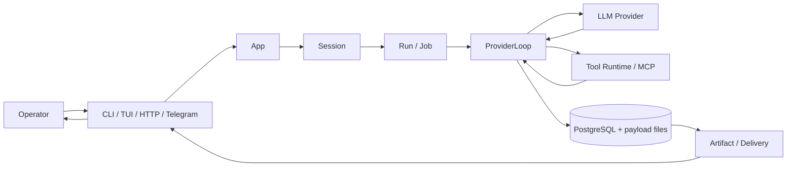

# Runtime mental model

Этот документ описывает текущую модель `teamD` одним сквозным языком: кто с кем говорит, где живут данные, что считается runtime state, а что является внешней обвязкой.

## Короткая формула

`teamD` — это host runtime `agentd` плюс тонкие surfaces вокруг него.

```text
Operator -> Surface -> App -> Session -> Run -> ProviderLoop -> ToolCall -> Artifact/Delivery
```

Главный инвариант: CLI, TUI, HTTP, Telegram, schedules и background workers не имеют своих отдельных chat loops. Они создают или читают одно и то же состояние через `App`, `ExecutionService`, `ProviderLoop` и `PersistenceStore`.



## Слои системы

### Operator

`Operator` — человек или внешний automation, который управляет агентами. Он может работать через:

- CLI: `agentd`, `teamdctl`;
- TUI: полноэкранный debug/operator UI;
- HTTP API daemon;
- Telegram bot;
- systemd и scripts для запуска, остановки, обновления и диагностики.

Operator не должен думать, что Telegram или TUI запускают “другого агента”. Это разные входы в один runtime.

### Surface

`Surface` — интерфейс взаимодействия. Surface отвечает за UX:

- принять входящее сообщение;
- преобразовать его в request к `App`;
- показать состояние run/job;
- доставить ответ, файл или ошибку;
- показать transcript, tool calls, artifacts и diagnostics.

Surface не должна:

- собирать свой prompt;
- исполнять свой tool loop;
- хранить отдельную историю;
- подменять workspace selection;
- превращать provider/tool ошибки в выдуманные ответы модели.

Telegram-specific логика допустима только на уровне доставки: typing/status messages, queue/coalescing, `sendDocument`, rate limits, pairing. Сам chat turn остаётся общим.

### App

`App` — корневой объект процесса `agentd`. Он собирается bootstrap-слоем из config, stores, runtime scaffold, registries и clients.

Через `App` проходят:

- session operations;
- chat turn execution;
- background jobs;
- schedule wakeups;
- inter-agent messages;
- tool/debug/session views;
- daemon HTTP handlers;
- CLI/TUI/Telegram adapters.

Если нужно добавить новую поверхность, она должна вызывать существующие `App` operations, а не копировать execution logic.

### Session

`Session` — durable диалог агента. Это не просто список сообщений. Вокруг session живут:

- transcript;
- runs;
- jobs;
- active plan;
- context summary;
- offload refs;
- approvals;
- schedules и wakeups;
- Telegram bindings;
- workspace root;
- agent profile id;
- inter-agent/delegation metadata.

Session закреплена за `Agent profile` и `workspace_root`. Это важно: tools должны работать в workspace session, а не в `agent_home`, `data_dir` или `/var/lib/teamd/state`.

### Run и Job

`Run` — одно выполнение модели внутри session.

`Job` — рабочая единица, которая запускает или продолжает run. Job нужен, потому что execution может быть:

- обычным пользовательским turn;
- Telegram inbound turn;
- scheduled wakeup;
- background continuation;
- inter-agent message;
- approval continuation;
- delegated work.

Один пользовательский request обычно создаёт job и run. Background worker берёт job, вызывает общий execution path и пишет результат обратно в store.

### ProviderLoop

`ProviderLoop` — главный execution loop. Он:

- загружает session context;
- собирает prompt в каноническом порядке;
- передаёт provider tools;
- обрабатывает provider response;
- выполняет tool rounds;
- пишет tool-call ledger;
- делает offload больших результатов;
- применяет completion/retry/repeated-tool-call guards;
- сохраняет финальный assistant text или ошибку.

Важное правило: provider loop не должен расползаться по surfaces. Ошибка в Telegram turn и ошибка в TUI turn должны отлаживаться в одном месте.

Текущая реализация уже расслаивается на helper-модули:

- `provider_cursor.rs` — cursor/state round loop;
- `provider_ledger.rs` — запись tool calls и результатов;
- `provider_tool_dispatch.rs` — выполнение model tool calls;
- `provider_prompt.rs` — prompt/session head/provider request helpers;
- `provider_offload.rs` — context offload/artifacts;
- `provider_completion.rs` — completion gate и финализация;
- `provider_text.rs` — нормализация assistant text.

### ToolCall

`ToolCall` — typed structured request от модели к capability.

Модель не должна писать shell snippets как интерфейс. Она вызывает named tools с JSON schema:

- filesystem tools;
- planning tools;
- execution tools;
- schedule/background tools;
- agent/session tools;
- artifact tools;
- web/search tools;
- delivery tools;
- MCP-discovered tools.

Каждый вызов должен быть виден в ledger:

- имя tool;
- arguments JSON;
- status;
- error;
- timestamps;
- result summary;
- bounded preview;
- optional result artifact id.

Это нужно для debug UI, аудита, улучшения tool descriptions и анализа ошибок модели.

### Artifact и Delivery

`Artifact` — durable payload, который не стоит держать целиком в prompt или PostgreSQL row. Примеры:

- большой stdout/stderr tool output;
- скачанный файл;
- Telegram upload;
- workspace file для отправки оператору;
- debug bundle;
- context offload payload.

`Delivery` — отдельный слой доставки payload пользователю. Например, `deliver_file` создаёт generic file delivery request, а Telegram surface потом доставляет его через `sendDocument`. Модель не должна знать Telegram internals и не должна придумывать fallback вроде “сохранил файл в vault”, если runtime поставил delivery request в очередь.

## Где живут данные

Production layout сейчас такой:

```text
/etc/teamd/
├── config.toml
└── teamd.env

/var/lib/teamd/state/
├── agent-templates/default/        # runtime-editable default template
├── agents/<agent_id>/              # legacy layout, copied to workspace on bootstrap
├── artifacts/                      # payload files
├── audit/runtime.jsonl             # daemon/runtime audit events
├── runs/                           # run payloads
└── transcripts/                    # transcript payload files

/var/lib/teamd/workspaces/
└── agents/<agent_id>/              # agent workspace: SYSTEM.md, AGENTS.md, skills/, tools cwd

/var/lib/teamd/knowledge/silverbullet/teamd/
└── ...                             # operator/agent knowledge notes
```

Разделение принципиальное:

- `/var/lib/teamd/state` — runtime state, не workspace;
- `/var/lib/teamd/state/agent-templates/default` — единственный встроенный template;
- `/var/lib/teamd/state/agents/<agent_id>` — legacy layout старых версий, не primary source;
- `/var/lib/teamd/workspaces/agents/<agent_id>` — canonical workspace агента, его prompts, skills и рабочая директория tools;
- `/var/lib/teamd/knowledge/silverbullet/teamd` — knowledge space, не transcript store;
- `/etc/teamd` — config и env, не runtime data.

## Agent workspace и knowledge

### Agent workspace

Agent workspace содержит поведение и рабочую область профиля:

- `SYSTEM.md`;
- `AGENTS.md`;
- `skills/`.

Это editable пространство конкретного `Agent profile`. При создании нового профиля prompts и skills копируются из default template в workspace профиля. Изменение template не должно молча менять уже существующий custom profile.

### Workspace

`Workspace` — место, где tools читают/пишут project files и запускают команды. По умолчанию для новых session это workspace выбранного agent profile. Конкретный путь сохраняется в session record.

Правила:

- tools используют session workspace;
- workspace не должен быть `data_dir`, `state`, `audit`, `transcripts` или `artifacts`;
- временные файлы не должны засорять корень workspace;
- долговременные результаты нужно класть в явные каталоги: `docs/`, `artifacts/`, `diagnostics/`, project-specific path или SilverBullet Space.

### Knowledge space

SilverBullet Space — текущий canonical knowledge add-on:

```text
/var/lib/teamd/knowledge/silverbullet/teamd
```

Его видят оператор и агент:

- оператор через web UI;
- агент через `silverbullet-space` skill;
- агент через SilverBullet MCP, если он включён;
- агент через filesystem tools как fallback.

SilverBullet не заменяет PostgreSQL, transcripts, tool calls, runs, jobs или artifacts.

Устаревшие note-taking add-ons не входят в supported runtime stack 1.2.0. Заметки ведутся через SilverBullet Space, а старые vault/graph директории не должны автоматически попадать в prompt или tool surface.

## Prompt path

Prompt собирается только одним путём. Порядок слоёв:

1. `SYSTEM.md`;
2. `AGENTS.md`;
3. `SessionHead`;
4. `Plan`;
5. `ContextSummary`;
6. offload refs;
7. uncovered transcript tail.

`SessionHead` нужен модели как компактное состояние runtime: профиль, provider/model, workspace, context budget, активные skills, schedules/subagents/agent2agent hints и текущие ограничения. Большие детали должны быть доступны через tools/artifacts, а не вставляться в prompt без лимита.

Если агенту нужен устойчивый урок или self-learning запись, она должна попасть в inspectable durable surface:

- профильные prompts/skills, если это изменение поведения;
- SilverBullet Space или docs, если это знание;
- Mem0 semantic memory, если это компактный durable факт, предпочтение, решение или урок, который нужно потом найти семантически;
- KV, если это exact JSON state, counter, cursor, flag или lightweight coordination value;
- artifact, если это большой payload;
- plan/memory/context summary, если это session-scoped state.

Mem0 не подмешивается в prompt скрыто. Если включён `memory_recall`, runtime перед provider request делает bounded semantic search по последнему user-сообщению и вставляет результат в видимый prompt block `Memory Recall`; этот блок можно увидеть в prompt preview/debug. Если агенту нужны дополнительные детали, он всё равно должен явно вызвать `memory_search` или `memory_list`, и такой вызов попадёт в tool ledger.

Semantic memory scopes не смешивают разные сущности:

- `operator` — предпочтения человека;
- `agent` — память конкретного профиля агента;
- `agent_shared` — общий пул lessons для всех агентов;
- `workspace` — проектная память, привязанная к workspace path-derived `agent_id = teamd-workspace-<hash>`;
- `session` — короткоживущая память конкретной сессии.

Mem0 нельзя использовать как скрытый KV. Для точных ключей, блокировок, счётчиков и runtime-очередей есть built-in `kv_*` tools поверх PostgreSQL table `kv_entries`; Mem0 отвечает только за семантический поиск по durable facts.

Optional post-turn `memory_curator` может записывать durable facts автоматически после ответа. В связке получается полный inspectable цикл: pre-turn recall читает релевантную память, обычный turn отвечает пользователю, post-turn curator сохраняет новые durable lessons.

## Tool/debug path

Для глубокого debug нужно смотреть не только transcript, но и ledger:

```bash
teamdctl session list
teamdctl session transcript <session_id> --limit 200
teamdctl session tools <session_id> --limit 200
teamdctl tui
```

TUI debug browser должен показывать:

- sessions;
- transcript entries;
- runs/jobs;
- tool calls;
- arguments;
- result previews;
- artifacts;
- delivery requests.

Это один и тот же data path: TUI и CLI читают `PersistenceStore`, а не отдельные debug logs.

## Container add-ons

Container layer не является вторым runtime. Он добавляет внешние сервисы:

- SearXNG для `web_search`;
- SilverBullet и SilverBullet MCP для notes/knowledge;
- Browserless для built-in `browser_*` automation через `agent-browser`;
- Mem0/OpenMemory REST endpoint для optional built-in `memory_*` semantic memory tools;
- Jaeger для traces;
- File Browser для operator editing;
- Caddy для routes.

Host `agentd` остаётся владельцем:

- sessions;
- runs/jobs;
- provider loop;
- tools;
- schedules;
- Telegram delivery;
- PostgreSQL state;
- artifacts;
- audit logs.

Если container падает, это должно ломать только соответствующий capability или UI, а не создавать альтернативную runtime state model.

## Что считать источником истины

| Вопрос | Источник истины |
| --- | --- |
| Что сказал пользователь или агент | Transcript/session store |
| Что выполнялось моделью | Run/job store |
| Какие tools вызваны | Tool-call ledger |
| Что вернул большой tool output | Artifact payload |
| Какой workspace у session | Session record |
| Какие prompts/skills у профиля | Agent workspace |
| Как настроен daemon | `/etc/teamd/config.toml` и `teamd.env` |
| Что видел operator через Telegram | Transcript + Telegram delivery/status records |
| Какие знания ведёт агент | SilverBullet Space или explicit docs/artifacts |
| Какие durable semantic memories записаны явно | Mem0/OpenMemory backend через `memory_*` tool ledger |
| Что случилось в daemon | `audit/runtime.jsonl` и `agentd logs` |

Если surface UI и store расходятся, store важнее. Если документация и код расходятся, код важнее, но документацию нужно обновить сразу после обнаружения расхождения.
