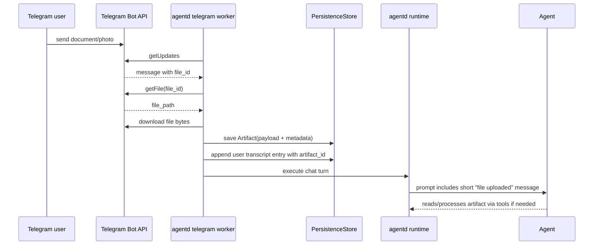

# Telegram file transfer: черновик v1

Документ фиксирует принятое направление для приёма и отправки файлов через Telegram.

Статус: design draft, код ещё не реализован.

## Цель

Пользовательский UX должен быть простым:

1. Оператор отправляет файл боту в Telegram.
2. Агент видит, что в текущую session пришёл файл.
3. Агент может прочитать или обработать файл через обычные runtime tools.
4. Агент может отправить файл обратно оператору.

Внутри runtime файл хранится как `Artifact`, но пользователь не должен думать в терминах artifacts. Для пользователя это обычный Telegram-файл.

## Почему внутри это Artifact

Файл нельзя класть напрямую:

- в prompt;
- в transcript body;
- в SQLite как большой blob;
- в рабочую директорию без явного решения агента.

`Artifact` уже является правильной абстракцией для больших payload:

- payload лежит в `data_dir/artifacts`;
- metadata лежит в SQLite;
- transcript хранит короткую ссылку;
- debug/TUI/CLI могут показать файл;
- agent tools могут читать artifact явно.

Иными словами: Telegram surface принимает “обычный файл”, а runtime сохраняет его как artifact, чтобы не ломать canonical execution path.

## Приём файлов

### Какие Telegram message types поддержать в v1

Минимальный v1:

- `document`;
- `photo`.

Следующие типы можно добавить позже тем же механизмом:

- `video`;
- `audio`;
- `voice`;
- `animation`.

`document` важнее всего, потому что через него пользователь может отправить почти любой файл.

### Flow приёма



### Что сохранять в metadata

Metadata artifact’а должна позволять понять источник файла без открытия Telegram:

- `source = "telegram"`;
- `telegram_chat_id`;
- `telegram_user_id`;
- `telegram_message_id`;
- `telegram_file_id`;
- `telegram_file_unique_id`;
- `telegram_file_path`, если доступен;
- `telegram_content_kind`: `document`, `photo`, etc.;
- `file_name`;
- `mime_type`;
- `file_size`;
- `caption`;
- `received_at`;
- `session_id`.

Для `photo` у Telegram может не быть нормального filename. Runtime должен сгенерировать безопасное имя, например:

```text
telegram-photo-<message_id>.jpg
```

### Что писать в transcript

В transcript не пишется бинарный payload. Пишется короткое user-visible сообщение:

```text
Пользователь загрузил файл.
name=report.xlsx
mime_type=application/vnd.openxmlformats-officedocument.spreadsheetml.sheet
size=123456
artifact_id=artifact-...
caption=...
```

Это сообщение нужно агенту как signal: появился файл, его можно читать через artifact/file tools.

### Что делать с caption

Если пользователь отправил файл с caption, caption должен считаться пользовательской инструкцией.

Пример:

```text
Файл: report.xlsx
Caption: "Проверь суммы и найди ошибки"
```

Runtime должен выполнить обычный chat turn с этим содержимым. Если caption пустой, агент всё равно должен получить событие “файл загружен”.

## Чтение файла агентом

В v1 возможны два варианта.

### Вариант A: использовать существующие artifact tools

Агент получает `artifact_id` и читает файл через `artifact_read`.

Плюсы:

- меньше нового surface;
- вписывается в текущий offload/artifact model.

Минусы:

- термин “artifact” хуже для модели, когда пользователь говорит “файл”;
- для бинарных форматов понадобится понятный output mode.

### Вариант B: добавить file-oriented tools поверх artifacts

Добавить generic tools:

- `file_list` — файлы текущей session;
- `file_read` — прочитать текстовый файл/preview;
- `file_info` — metadata;
- `file_extract_text` — позже, если появятся extractor’ы для PDF/DOCX/XLSX;
- `deliver_file` — отправить файл пользователю через активную surface.

Внутри эти tools всё равно работают с artifacts.

Плюсы:

- агенту проще понимать “файлы”;
- Telegram/TUI/CLI могут использовать один язык;
- легче документировать для пользователя.

Минусы:

- больше кода и tests.

Рекомендация: v1 можно начать с `artifact_read`, но быстро добавить file-oriented aliases/tools, чтобы агент не путался.

## Отправка файлов пользователю

### Главная идея

Агент не должен вызывать Telegram-specific tool вроде `telegram_send_document`.

Лучше сделать generic delivery:

```text
deliver_file artifact_id=... target=current_user/current_chat
```

Surface сама решает, как доставлять:

- Telegram отправляет `sendDocument`;
- TUI показывает artifact и даёт открыть/save;
- CLI печатает путь/команду;
- HTTP отдаёт ссылку или JSON.

Так сохраняется принцип: Telegram не создаёт второй runtime path.

### V1 для Telegram

Минимальный v1:

- `TelegramClient::send_document(chat_id, bytes/path, filename, caption)`;
- команда `/files` показывает файлы текущей session;
- команда `/file <id>` отправляет выбранный файл в Telegram;
- runtime/tool `deliver_file` можно добавить следующим шагом.

При этом нормальный сценарий должен быть таким:

- агент сам создаёт или выбирает файл;
- агент вызывает generic delivery;
- Telegram worker отправляет документ;
- оператор получает обычный файл в Telegram.

### Откуда берётся файл для отправки

Источники:

- файл, который ранее загрузил пользователь;
- artifact, созданный tool output;
- файл из workspace, который агент явно сохранил как artifact;
- generated report/export.

Нельзя отправлять произвольный path с диска без проверки. Сначала файл должен стать artifact или пройти через controlled runtime API.

## Операторские команды

Минимальный набор Telegram-команд:

```text
/files
/file <artifact_or_file_id>
```

Возможные aliases:

```text
/attachments
/send_file <artifact_or_file_id>
```

`/files` должен показывать не все artifacts вообще, а user-relevant files текущей selected session.

Пример вывода:

```text
Files in current session:
1. report.xlsx
   id: file-...
   size: 123 KB
   source: telegram
   received: 2026-04-24 12:00

Send back:
/file file-...
```

## Лимиты Telegram Bot API

Официальная Bot API модель:

- `getFile` позволяет скачать файл через `https://api.telegram.org/file/bot<token>/<file_path>`.
- Cloud Bot API ограничивает download файла размером до 20 MB.
- File download URL гарантированно живёт минимум 1 час.
- `sendDocument` через обычный Bot API ограничен 50 MB.
- `sendPhoto`/photo upload имеет меньший лимит: 10 MB для photos.
- Если файл уже хранится на Telegram servers и отправляется по `file_id`, reupload не нужен.
- Для больших лимитов нужен local Telegram Bot API server.

Ссылки:

- `getFile`: https://core.telegram.org/bots/api#getfile
- `Sending files`: https://core.telegram.org/bots/api#sending-files
- `sendDocument`: https://core.telegram.org/bots/api#senddocument
- Local Bot API server: https://core.telegram.org/bots/api#using-a-local-bot-api-server

## Конфигурация

В `config.toml` уже есть связанные параметры:

```toml
[telegram]
max_upload_bytes = 16777216
max_download_bytes = 41943040
```

Названия надо уточнить перед реализацией, потому что для Telegram они легко путаются:

- upload к нам из Telegram;
- download от Telegram;
- отправка пользователю;
- получение от пользователя.

Рекомендуемая явная схема:

```toml
[telegram.files]
enabled = true
max_receive_bytes = 20971520
max_send_bytes = 52428800
accept_documents = true
accept_photos = true
accept_group_files_only_when_mentioned = true
```

Если используем local Bot API server, лимиты можно поднять отдельной настройкой, но это должно быть явное решение оператора.

## Безопасность

Правила v1:

- принимать файлы только от activated pairing;
- в группах принимать файлы только при mention бота, reply-to bot или command/caption, если `group_require_mention = true`;
- проверять `file_size` до скачивания;
- не скачивать файл больше configured limit;
- санитизировать filename;
- не писать файл напрямую в workspace;
- не исполнять файл;
- не распаковывать архивы автоматически;
- не извлекать текст из сложных форматов без отдельного extractor policy;
- хранить source metadata для audit;
- показывать artifact/file id оператору.

## Почему не userbot

Этот документ описывает Bot API. Userbot — отдельный класс интеграции: клиент Telegram от имени пользовательского аккаунта, а не bot token.

Текущий Telegram worker построен вокруг:

- `teloxide`;
- Bot API token;
- long polling `getUpdates`;
- Bot API methods (`sendMessage`, `editMessageText`, `getFile`, `sendDocument`).

Userbot на этом движке не получится сделать “переключателем”. Нужен другой Telegram client stack, например MTProto/TDLib, отдельная авторизация по phone/login/session и отдельная модель безопасности.

## Реализация по шагам

### Step 1: receive document/photo as artifact

- расширить `handle_message`, чтобы он обрабатывал non-text messages;
- извлекать Telegram file metadata;
- скачивать файл через `getFile` + download;
- сохранять artifact;
- писать user transcript entry;
- запускать обычный chat turn.

### Step 2: operator commands

- добавить `/files`;
- добавить `/file <id>`;
- отправлять artifact payload через `sendDocument`.

### Step 3: agent delivery tool

- добавить generic `deliver_file`;
- сделать Telegram implementation через `sendDocument`;
- TUI/CLI оставить как debug/operator view.

### Step 4: better file reading

- добавить file-oriented aliases/tools;
- для text files показывать содержимое;
- для бинарных files показывать metadata и preview;
- позже добавить extractors для PDF/DOCX/XLSX.

